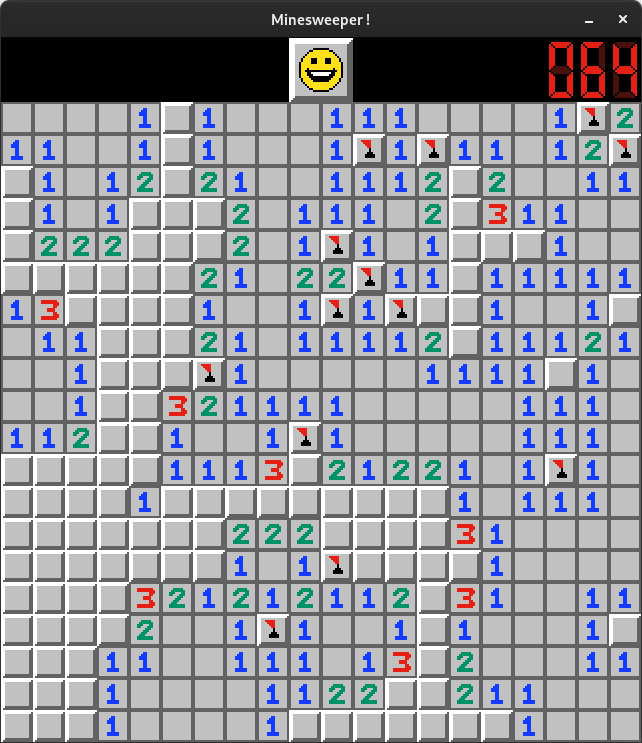
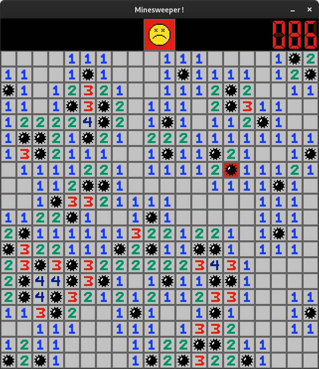

# Minesweeper C Clone

A simple Minesweeper clone writen in C/CSFML

## How to play ?

The rules are simple, just like on the good old classic Minesweeper.\
You just have to flag every mine without making them explode!

## Keybinds

* Flag a mine -- **Right mouse button**
* Clear a cell (or more!) -- **Left mouse button**
* Restart the game -- **T**
* Close the game -- **Escape**
* Reveal the mines (This is kinda cheating!) -- **X**

## Compilation

For the moment the game is only available for *Linux* distibutions.\

To compile the game make sure you have the __SFML__ binding for C (___CSFML___) installed on your computer.

After cloning the repo enter the following commands:
```
$ make
$ ./minesweeper
```

## Screenshots



